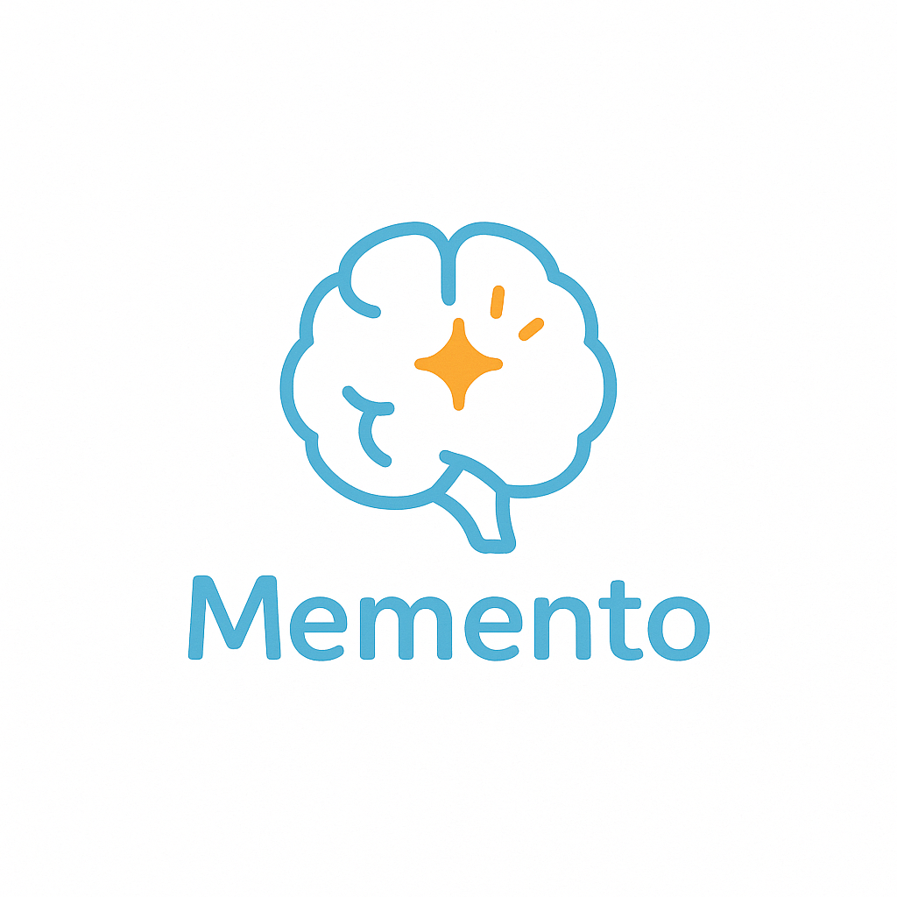
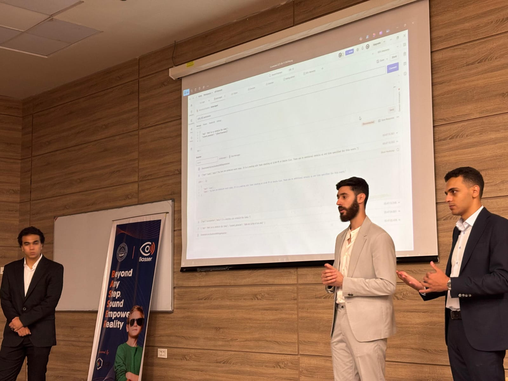

# Memento — AI-Enabled Mobile Memory Assistant

**Memento** is an AI-enabled mobile memory assistant designed to help users—especially older adults and people with memory-related challenges—capture daily events, extract important tasks, receive timely reminders, and query past activities using natural language.

The project combines an accessible Flutter mobile app with a cloud-hosted AI backend. On-device speech recognition captures spoken information, while backend agents extract structured events, manage conversational context, detect conflicts, store semantic memories, and return concise answers to user queries.

---

## Table of Contents

- [Why Memento](#why-memento)
- [Core Features](#core-features)
- [How the System Works](#how-the-system-works)
- [Architecture and Implementation](#architecture-and-implementation)
  - [Mobile App / On-Device Layer](#mobile-app--on-device-layer)
  - [Backend / Cloud Layer](#backend--cloud-layer)
  - [Storage and Retrieval](#storage-and-retrieval)
  - [Authentication and User Management](#authentication-and-user-management)
- [Architecture Diagrams](#architecture-diagrams)
- [Testing and Validation](#testing-and-validation)
- [Discussion](#discussion)
- [Team](#team)
- [Poster](#poster)
- [Demo](#demo)
- [Licence](#licence)

---

## Why Memento

Memento was built as a context-aware daily task assistance system that acts like a memory companion. The app is designed to:

- reduce dependence on caregivers for remembering tasks and appointments,
- capture important spoken information in the background,
- transform raw speech into structured events,
- deliver reminders at the right time or place,
- and answer natural-language questions about previously stored events.

The project is particularly meaningful for Alzheimer’s support, but the architecture is general enough to serve broader productivity and life-assistance use cases.

---

## Core Features

### 1) Passive event capture
- Runs a background assistant that listens in passive mode.
- Uses speech recognition to convert spoken content into text.
- Buffers recognized text and sends it to the backend through WebSocket for task inference.
- Detects inactivity and disables passive mode automatically to conserve resources.

### 2) Active voice/text interaction
- Users can explicitly interact with the app using voice or text.
- Queries such as “What do I have tomorrow?” or “Where did I have lunch yesterday?” are routed to the backend and answered using stored event memory.

### 3) Time-based reminders
- Extracted events can generate reminders based on timestamps.
- Notifications can be shown visually and optionally read aloud.

### 4) Location-based reminders
- The app checks the user’s location periodically.
- When the user gets close to a relevant place, the app triggers a context-aware reminder.

### 5) Event conflict detection
- New events are checked against previously stored events.
- The backend prevents conflicting insertions unless overlap is explicitly allowed.

### 6) Semantic event search
- Stored events are embedded and indexed in a vector database.
- The system can answer memory-style questions using semantic retrieval instead of exact keyword matching only.

### 7) In-app Dashboard / Activity Diary
Provides a historical view of the user’s behavior, captured activities, completed tasks, reminders, and interaction patterns inside the app. This feature acts as a personal activity diary, helping users review what happened over time, understand daily and weekly trends, and gain insights into routines, productivity, and memory-related behavior through organized summaries and visualized records.

### 8) Accessibility-first UI
- Built with large-font support, high-contrast UI patterns, readable layouts, and voice-friendly interaction.
- Designed to reduce cognitive load for elderly users and users with cognitive impairments.

### 9) Privacy-aware controls
- Users can control passive listening.
- Background listening is exposed through a persistent notification.
- The settings flow allows reminder and privacy preferences to be controlled clearly.

---

## How the System Works

Memento operates through three main modes:

### Event Recording Mode
The mobile app captures speech during passive mode using on-device recognition. Recognized text is buffered, stored locally when needed, then streamed to the backend. The backend filters irrelevant content, extracts useful event details, and stores structured event memory.

### Reminder Mode
Events can trigger:
- **time-based reminders** using scheduled local notifications, and
- **GPS-based reminders** using nearby-place matching and geolocation checks.

### Interactive Query Mode
Users can ask about past or upcoming activities in natural language. The backend converts the query into embeddings, searches the vector store for relevant event memories, and generates a concise answer.

---

## Architecture and Implementation

## Mobile App / On-Device Layer

The app is implemented in **Flutter** for cross-platform Android/iOS support.

### UI design
The UI is the main interaction point and was designed for clarity, low cognitive load, and accessibility. It supports:
- large fonts,
- high-contrast display,
- voice commands,
- readable and scrollable event results,
- easy access to reminders, recording preferences, and query flows.

### Background service architecture
The app uses a continuously running background service to power passive assistance. This service contains two major periodic functions:

#### Function 1: voice-based event detection
- Executes every 2 minutes.
- Aggregates speech recognition results collected during passive listening sessions.
- Stores recognized text locally for persistence if there is no internet connection.
- Verifies connectivity.
- Opens a WebSocket channel if needed.
- Sends recognized text to the backend agent workflow.
- Receives inferred reminders/events and routes them to local reminder scheduling.

#### Function 2: location-based reminder activation
- Executes every 10 minutes.
- Retrieves the user’s current GPS position.
- Compares the location against locally stored place-based events.
- Triggers notifications when the user approaches a relevant place.

### Permissions and privacy implementation
The app groups permissions by purpose:
- microphone and internet access,
- Bluetooth input support,
- background/foreground service execution,
- notifications and exact alarm scheduling,
- location access,
- device audio mode control / Do Not Disturb handling.

The implementation also makes privacy visible:
- passive mode can be disabled at any time,
- a persistent system notification indicates background listening,
- reminder behavior such as vibration and read-aloud can be customized.

### Speech recognition implementation

**device-native `speech_to_text` with built-in VAD**  
   The final implementation direction emphasized native speech services, built-in voice activity detection, low storage overhead, and efficient operation for passive mode.

### Packages and mobile-side components mentioned in the thesis
- `speech_to_text`
- `flutter_background_service`
- `web_socket_channel`
- `flutter_local_notifications`
- `geolocator`
- `connectivity_plus`
- `shared_preferences`

---

## Backend / Cloud Layer

The backend is built as a cloud-hosted service that combines:
- **FastAPI** for REST and WebSocket endpoints,
- **LangGraph** for stateful agent orchestration,
- **Gemini 2.5 Flash** for extraction, summarization, and response generation,
- **Weaviate** for vectorized event memory,
- **PostgreSQL** for user/business data and short-term conversational state.

### Workflow orchestration with LangGraph
**`LangGraph`** is embedded directly inside the FastAPI service and coordinates multi-step reasoning across a set of agent nodes:

- **Router Node** — decomposes user input into subtasks and requests clarifications when needed.
- **Schedule Node** — extracts event details and persists new events.
- **Update Node** — updates or cancels existing events.
- **Query Node** — performs semantic retrieval over stored events and generates answers.
- **Conversation Node** — handles direct conversational replies.
- **Streaming Reply Node** — flushes agent messages back to the client.
- **Summarization Node** — trims older conversation history into a compact summary.

This structure allows Memento to support active queries, multi-step conversations, scheduling, updates, conflict handling, and memory-aware replies within one coherent workflow.

### LLM integration
Memento uses **Gemini 2.5 Flash** to:
- extract event title, time, location, and relevant details from natural language,
- help route and interpret user requests,
- summarize retrieved events into direct user answers,
- and compress older conversation context when message history becomes large.

---

## Storage and Retrieval

### BusinessDB
A PostgreSQL database stores persistent user account information and application business data.

### StateDB
A separate PostgreSQL instance stores short-term conversational memory, subtask state, recent messages, and workflow progress so the assistant can resume multi-turn interactions reliably.

### Weaviate vector store
Events are stored as structured JSON objects plus semantic embeddings. The custom `VectorStore` abstraction handles:
- event insertion,
- tenant isolation per user,
- conflict checking,
- exact filtering,
- semantic search,
- and event updates/deletions.

### Retrieval strategy
Memento supports two retrieval paths:

- **Exact / property-based retrieval** for structured queries.
- **Semantic retrieval** for open-ended questions using query embeddings & nearest-neighbor search & LLM summarization.

This lets the system behave more like a memory assistant than a simple reminder app.

---

## Authentication and User Management

The backend includes:
- signup and login endpoints,
- JWT issuance for authenticated sessions,
- OAuth2-style bearer-token handling for protected endpoints,
- password hashing,
- request-scoped DB sessions,
- and secure secret/configuration management.

The BusinessDB user schema includes core account information such as full name, email, gender, age, password hash, and creation/update timestamps.

---

## Architecture Diagrams

### 1) End-to-end system block diagram

This figure shows the split between the on-device pipeline and the cloud pipeline, including passive capture, temporary memory, speech processing, WebSocket communication, agent workflow, short-term state, and vectorized event storage.

### 2) Background service functions

This diagram summarizes the two periodic background functions:
- voice-driven event detection
- location-driven reminder activation.

### 3) Speech recognition design

selected direction using native speech_to_text & VAD

### 4) Active-agent graph

This diagram shows how user input is routed into schedule, update, delete, query, and conversation sub-agents, with short-term memory, long-term memory, and summarization integrated into the workflow.

---

## Testing and Validation

The implementation was validated through:
- **unit testing** for schedule extraction, updates, deletions, routing, and query behavior,
- **integration testing** across the full pipeline,
- and **latency benchmarking** for major backend operations.
Reports **42 unit tests**, with **38 passing**, for an overall accuracy of approximately **90.5%** across the tested sub-agents.

---

## Discussion

Memento demonstrates how a hybrid mobile & AI system can provide real-world assistance rather than only chatbot-style interaction. The project combines:

- passive speech capture,
- accessible mobile UX,
- semantic event memory,
- context-aware reminders,
- and stateful AI orchestration.

From a system-design perspective, the strongest contribution is the balance between **on-device efficiency** and **cloud intelligence**:

- on-device speech handling and reminder scheduling reduce dependence on constant connectivity,
- cloud-hosted language intelligence improves event understanding and question answering,
- and vector memory enables retrieval of past events in a natural way.

## Team

| Memento Team | Memento Team | Memento Team |
|--|--|--|--|--|
|  |  |  |

---

## Poster

## Demo

Marketing: https://youtu.be/4dHcKl4IGik
Demo: https://youtube.com/shorts/i2Lab8Lez54

---

## Licence

**Important Notice:** This repository is publicly available for viewing only. Forking, cloning, or redistributing this project is **NOT** permitted without explicit permission.

Copyright (c) 2025 Contributors:

- Muhammad Essam Khattab
- Youssef Alaa Abou-Almagd
- Ahmed Samy

